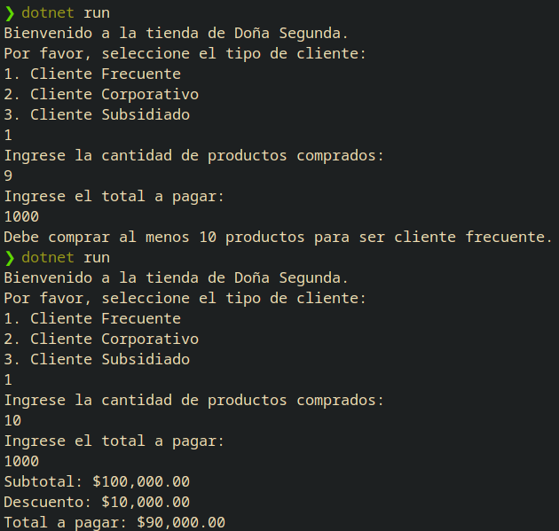
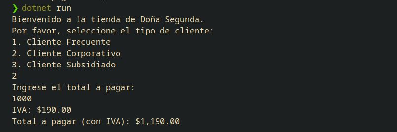
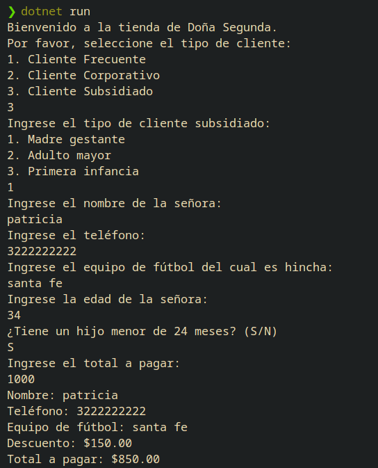
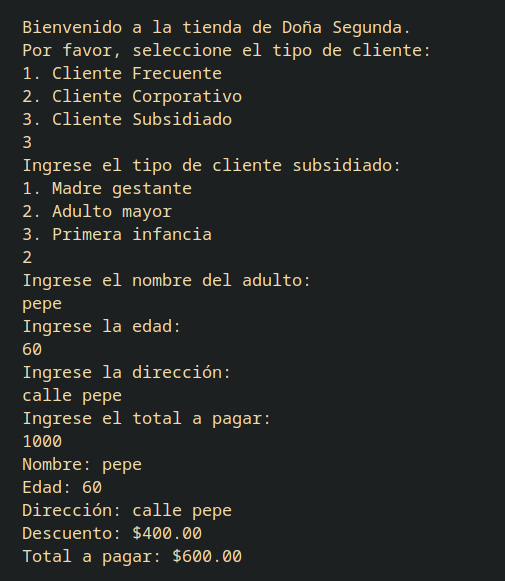
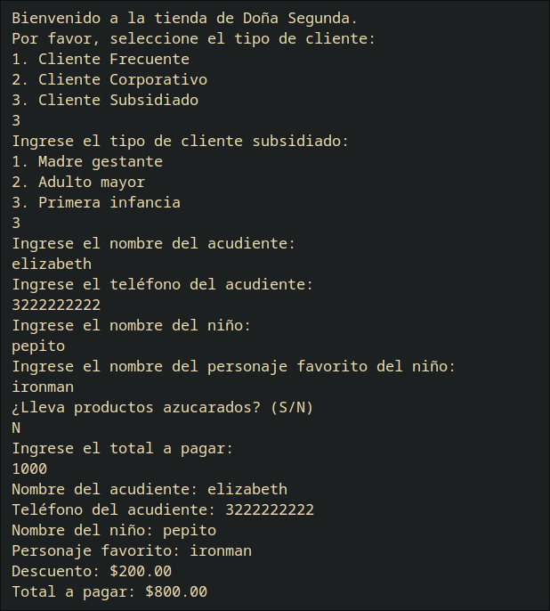

De acuerdo al tema de formación y al ejercicio planteado en formación, debe desarrollar un programa el cual se ejecute por consola, que liquidar el valor de las compras realizadas en la tienda de Doña Segunda, de acuerdo al tipo de cliente, según se detalla a continuación:

1. Cliente frecuente: este cliente debe comprar mínimo 10 productos, debe ser persona natural y se otorgará el 10% de descuento; no paga IVA. 
2. Cliente corporativo: debe cancelar el 100% de la compra y paga el IVA correspondiente al 19% del subtotal de la compra
3. Cliente subsidiado, en esta categoría se definen tres tipos de clientes: 
3.1 Cliente "Madre gestante": debe ser de genero femenino, ser menor de 40 años y tener mínimo un hijo menor de 24 meses, a este tipo de cliente no se le cobra IVA o se le otorga el 15% de descuento. Además, de los datos de la compra (total de productos, subtotal, valor de descuento, valor neto a pagar), debe mostrar: el nombre de la señora, el teléfono y el equipo de futbol del cual es hincha. 
3.2 Cliente "Adulto mayor": debe ser mayor de 60 años, se le otorga el 40% de descuento, no paga IVA.  Además, de los datos de la compra (total de productos, subtotal, valor de descuento, valor neto a pagar), debe mostrar: el nombre del adulto, la edad y la dirección del lugar donde vive.
3.3 Cliente "Primera infancia": debe ser menor de 12 años, NO puede comprar productos azucarados, no paga IVA y se le otorga el 20% de descuento. 
RESULTADOS:

1. Cliente frecuente:

2. Cliente Corporativo:

3. Cliente Subsidiado:
3.1. Madre gestante:

3.2. Adulto Mayor:

3.3. Primera Infancia:
